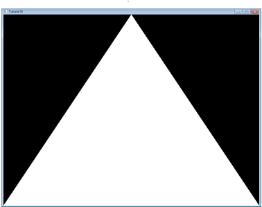

# Tutorial 1: Aprire una finestra

## Compilazione sotto Windows
1. Per prima cosa scarichiamo i file sorgenti del tutorial da GitHub.
2. Apriamo CMake e impostiamo la cartella dei sorgenti (quella in cui c'è il file CMakeList.txt) e quella in cui vogliamo che i file siano generati
3. Clicchiamo su Configure e scegliamo il compilatore
4. Cliccare su Configure fino a quando non scompaiono tutte le linee rosse
5. Cliccare su Generate

In questo caso abbiamo scelto come compilatore quello di Visual Studio 2022. Questo compilatore viene installato automaticamente quando si scarica Visual Studio 2022; se VS2022 funziona correttamente, testabile attraverso un Hello World, allora quando utilizzeremo cmake e selezioneremo come compilatore Visual Studio 2022 non avremo problemi. Sotto queste ipotesi avremo, nella cartella di destinazione che abbiamo impostate al punto 2, tutto il progetto Visual Studio generato, con in particolare il file Tutorials.sln. Nota che i file non sono ancora compilati, infatti se proveremo a lanciare gli script presenti in quella cartella otterremo errore in quanto non vengono trovati gli eseguibili. Quindi, in definitiva, abbiamo utilizzato cmake per generare un progetto visual studio. Ora, dall'IDE di Visual Studio, procederemo alla compilazione. 

Dopo aver aperto il progetto .sln in Visual Studio facciamo tasto destro "Compila Soluzione". Dopo aver compilato in modalità Debug, nella stessa cartella in cui c'è il file .sln troveremo un'altra cartella chiamata debug in cui al suo interno ci saranno gli eseguibili dei vari progetti dei tutorial. 

## Visualizzare una finestra
Nel primo tutorial vediamo semplicemente come aprire una finestra. Analizziamo gli include:

    #include<GL/glew.h>
Includiamo glew, approfondiremo in seguito. 

    #include<GLFW/flfw3.h>
Includiamo GLFW, la quale gestirà la window (la finestra che verrà aperta), il mouse e la tastiera. In altri tutorial questa cosa viene fatta a basso livello, noi staremo più alti con GLFW.

    #include<glm/glm.hpp>
    using namespace glm;
questa è una libreria per matematica 3D. Usiamo anche il namespace glm in modo da poter scrivere vec3 al posto di glm::vec3. 

Ora, dentro al main, per prima cosa inizializziamo GLFW, che ci servirà per la finestra:

    // Initialise GLFW
    glewExperimental = true; // Needed for core profile
    if( !glfwInit() )
    {
        fprintf( stderr, "Failed to initialize GLFW\n" );
        return -1;
    }

Arrivati a questo punto possiamo aprire la prima finestra con al suo interno il contesto OpenGL. Il contesto OpenGL è l'area di lavoro grafica. Ad esempio, abbiamo l'interfaccia principale e, al suo interno, il contesto OpenGL in cui verrà renderizzata tutta la parte grafica:

    // Open a window and create its OpenGL context
    GLFWwindow* window;
	window = glfwCreateWindow( 1024, 768, "Tutorial 01", NULL, NULL);
    glfwMakeContextCurrent(window);

In particolare, creo una finestra di 1024x768, con titolo Tutorial 01. Creo il contesto OpenGL all'interno di questa finestra, creata con GLFW. 

## Sommario
In questo tutorial abbiamo visto come effettuare il setup per Visual Studio 2022, ossia abbiamo scaricato i sorgenti del tutorial da GitHub, poi tramite cmake abbiamo generato il file Tutorials.sln che abbiamo aperto con Visual Studio e abbiamo compilato. Poi abbiamo creato la prima finestra GLFW in cui al suo interno abbiamo inserito un contesto OpenGL. Lanciando questo tutorial vediamo a schermo una finestra con contesto OpenGL. 

# Tutorial 2: il primo triangolo
Questo sarà un altro lungo tutorial. Le OpenGL permettono di scrivere cose difficili in modo semplice ma al costo di tribolare un po' per disegnare un semplice triangolo. 

## Il VAO
Non entreremo nei dettagli ora, ma dobbiamo creare un Vertex Array Object (VAO.) Questo va fatto dopo aver creato la finestra GLFW con il contesto OpenGL. Quindi, creo la finestra con GLFW, assegno alla finestra appena creata il contesto OpenGL e, successivamente, creo il VAO. È importante creare il VAO in questo ordine e prima di ogni altra chiamata OpenGL. Per quanto riguarda il VAO ci sono molti tutorial su cui approfondire, ma non ha molta importanza. 

## Coordinate dello schermo
Un punto nello spazio è definito da 3 coordinate X, Y e Z. In Computer Graphics un punto nello spazio è detto anche vertice. Un triangolo ha 3 vertici, per cui dovremo esplicitare un vettore di 9 coordinate (3 per ogni vertice) per definire completamente dove si trovano nello spazio i 3 vertici del triangolo, in modo univoco ed inequivocabile:

    // An array of 3 vectors which represents 3 vertices
    static const GLfloat g_vertex_buffer_data[] = {
                                -1.0f, -1.0f, 0.0f,
                                1.0f, -1.0f, 0.0f,
                                0.0f,  1.0f, 0.0f,
                                };
Il sistema di riferimento di tutte le schede grafiche ha il punto (0,0) al centro e ha direzione X positiva versa destra e direzione Y positiva verso l'alto. Normalizzando tutto tra [-1,1] riusciamo a coprire tutte le posizioni dello schermo. (Qua ci starebbe bene una bella foto del tutorial)

## Disegnare il nostro triangolo
Quindi, abbiamo creato il triangolo, semplicemente come un set di 3 vertici. Ora dobbiamo dare questo triangolo alle OpenGL in modo che possa essere visualizzato a video. Questo lo facciamo creando un buffer e passandogli il vettore che abbiamo creato sopra:

    glBufferData(GL_ARRAY_BUFFER, sizeof(g_vertex_buffer_data), g_vertex_buffer_data, GL_STATIC_DRAW);

Questo è da fare soltanto una volta, quindi assegniamo una volta e basta il nostro triangolo (ossia un set di punti nello spazio) al buffer OpenGL. All'interno del loop invece dobbiamo chiamare la funzione:

    glDrawArrays(GL_TRIANGLES, 0, 3); // Starting from vertex 0; 3 vertices total -> 1 triangle

In questo modo l'output del codice è un triangolo bianco su sfondo nero. Quindi, abbiamo creato un triangolo come un set di vertici, lo abbiamo passato al buffer OpenGL e, all'interno del loop, abbiamo chiamato la funzione DrawArrays per visualizzarlo a video. Per mostrare il triangolo in colori differenti dobbiamo introdurre gli shaders. Nota: potrebbe essere che non venga visualizzato il triangolo in bianco e nero perchè non sono stati definiti gli shaders. 

## Shaders
### Compilazione degli Shader
Nella configurazione più semplice avremo bisogno di due shader:
- vertex Shader: è un pezzo di codice che verrà eseguito per ogni vertice
- fragment Shader: è un pezzo di codice che verrà eseguito per ogni sample. Siccome usiamo un 4x antialiasing, avremo 4 samples per ogni pixel. Nel caso in cui avremo un 1x antialiasing il numero di sample coincide con il numero di pixel. Quindi, in prima battuta, possiamo considerare che il fragment shader viene eseguito per ogni pixel. 

Il linguaggio in cui si scrivono gli shader è chiamato GLSL, ossia GL Shader Language. A differenza di altri linguaggi di programmazione come il C gli shader sono compilati a runtime, quindi ogni volta che lanciamo la nostra applicazione essi vengono ricompilati. Normalmente, i due shader risiedono in due file separati. L'estensione del file è irrilevante, noi utilizzeremo .fragmentshader e .vertexshader, ma potrebbe tranquillamente essere .txt o .glsl. 

Per la compilazione degli shader abbiamo una funzione che viene chiamata all'interno del main, una sola volta nel nostro codice. Nel tutorial è la seguente:

    GLuint LoadShaders(const char * vertex_file_path,const char * fragment_file_path);

non è fondamentale comprenderla appieno, ci basti sapere che serve per compilare gli shaders. Quindi, all'interno del nostro main, ci ritroveremo una cosa del genere:

    	GLuint programID = LoadShaders( "SimpleVertexShader.vertexshader", "SimpleFragmentShader.fragmentshader" );

### Il nostro Vertex Shader
Iniziamo a sviluppare il nostro Vertex Shader. Per prima cosa dichiariamo che stiamo usando la sintassi delle OpenGL 3 con l'istruzione:

    #version 330 core

La seconda linea invece è la seguente:

    layout(location = 0) in vec3 vertexPosition_mondelspace;

Dove:

- vec3: è un vettore di 3 componenti nel linguaggio GLSL
- layout(location = 0):
- vertexPosition_modelspace: conterrà la posizione del vertice per ogni run del vertex shader
- in indica che sono dati di input

Abbiamo detto che i vertex shader vengono chiamati per ogni vertice. Quindi, per ogni vertice, viene eseguita la funzione main:

    void main(){    
        gl_Position.xyz = vertexPosition_modelspace;
        gl_Position.w = 1.0;
    }

qua dentro stiamo semplicemente assegnando la posizione del vertice in quello che c'è nel buffer. In definitiva, ho i 3 vertici del triangolo, li assegno al buffer. Per ogni vertice eseguo il vertex shader che assegna la posizione del buffer all'interno di gl_Position. 

### Il nostro Fragment Shader
    #version 330 core
    out vec3 color;
    void main(){
        color = vec3(1,0,0);
    }
nel fragment shader stiamo semplicemente assegnando il colore rosso ad ogni frammento. Abbiamo usato un 4x AA (antialiasing) quindi avremo 4 frammenti per ogni pixel. Con questo shader stiamo semplicemente dicendo che ogni "pixel" deve essere di colore rosso. 

## Mettendo tutto insieme
Quindi, abbiamo creato i nostri shader, ora è il momento di richiamarli da codice. Non dovremo fare altro che compilare i nostri shader a runtime con la funzione che abbiamo creato LoadShaders e poi dire che useremo questi shader:

    // Create and compile our GLSL program from the shaders
    GLuint programID = LoadShaders( "SimpleVertexShader.vertexshader", "SimpleFragmentShader.fragmentshader" );
    // Use our shader
    glUseProgram(programID);

in questo modo otterremo in output il triangolo rosso. 

